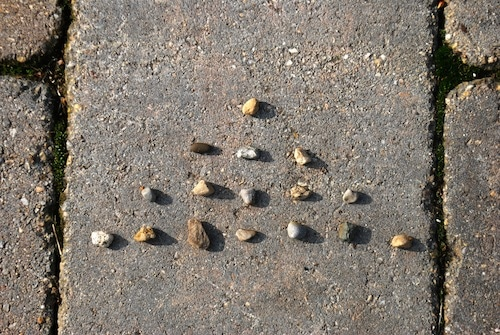

# CryptoNim

**Let's play Nim!**



A decentralized implementation of the classic game of Nim, built on Ethereum.

## What is Nim?

Nim is a mathematical strategy game where two players take turns removing objects from distinct heaps or piles. On each turn, a player must remove at least one object, and may remove any number of objects provided they all come from the same heap. The goal of the game is to avoid taking the last object.

[Learn more about Nim on Wikipedia](https://en.wikipedia.org/wiki/Nim)

## Features

- Smart contract implementation of Nim on Ethereum
- Web interface for playing the game
- Random board generation for each game
- Turn-based gameplay with proper validation
- Real-time game state updates
- Winner determination when the last stone is taken

## Prerequisites

- [Node.js](https://nodejs.org/) (v16 or later)
- [Foundry](https://book.getfoundry.sh/getting-started/installation)
- [MetaMask](https://metamask.io/) or other Web3 wallet
- [Git](https://git-scm.com/)

## SSH Setup

1. Generate a new SSH key:

```bash
ssh-keygen -t ed25519 -C "your_email@example.com" -f ~/.ssh/id_ed25519_github
```

2. Add the SSH key to your GitHub account:

   - Copy your public key:

   ```bash
   cat ~/.ssh/id_ed25519_github.pub
   ```

   - Go to GitHub → Settings → SSH and GPG keys → New SSH key
   - Paste your public key and save

3. Configure Git with your GitHub information:

```bash
git config --global user.name "Your GitHub Username"
git config --global user.email "your_email@example.com"
```

4. Configure SSH to use your key:

```bash
echo -e "Host github.com\n  IdentityFile ~/.ssh/id_ed25519_github\n  User git" > ~/.ssh/config
```

5. Verify your connection:

```bash
ssh -T git@github.com
```

## Installation

1. Clone the repository:

```bash
git clone https://github.com/GriffinSSloves/CryptoNim.git
cd CryptoNim
```

2. Install dependencies:

```bash
npm install
```

3. Create a `.env` file in the root directory:

```bash
touch frontend/.env
```

4. Update the `.env` file with your configuration:

```bash
VITE_ONCHAINKIT_API_KEY=<your API key>
```

## Running Locally

1. Start the development server:

```bash
npm run dev
```

2. Open your browser and navigate to `http://localhost:<port>`

## Playing the Game

1. Connect your wallet to the application
2. Create a new game by clicking "New Game"
3. Share the game ID with your opponent
4. Your opponent can join using the game ID
5. Take turns removing any number of stones from any row
6. The player who takes the last stone loses, and the other player wins

## Testing

Run the test suite:

```bash
forge test
```

For more detailed test output:

```bash
forge test -vv
```

## Smart Contract Documentation

The smart contract provides the following main functions:

- `initializeGame()`: Creates a new game with a random board
- `joinGame(gameId)`: Allows a second player to join an existing game
- `playTurn(gameId, row, stones)`: Takes a turn by removing stones from a row. Rows are 0-indexed.
- `viewGame(gameId)`: Returns the current state of a game
- `getAvailableGames()`: Lists all games waiting for a second player

## Contributing

1. Fork the repository
2. Create your feature branch (`git checkout -b feature/amazing-feature`)
3. Commit your changes (`git commit -m 'Add some amazing feature'`)
4. Push to the branch (`git push origin feature/amazing-feature`)
5. Open a Pull Request

## License

This project is licensed under the MIT License - see the [LICENSE](LICENSE) file for details.
